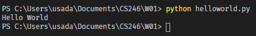

# OVERVIEW
This program will say Hello to the World. It is my way to 
demonstrate that I am learning Python and this is my first project/lesson

## Development Environment

* Visual Studio Code
* Python 3

## Execution

To execute the program, use the command: `python helloworld.py` on your terminal

## Useful Websites

* [Python Microsoft Tutorial](https://www.youtube.com/watch?v=jFCNu1-Xdsw)